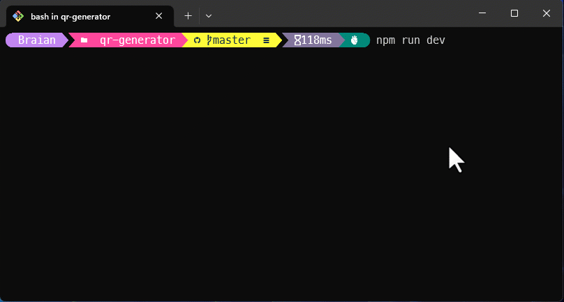

# Generador QR 📱
<p>
  <a href="https://vitejs.dev/" target="_blank">
    
  </a>
  <a href="https://pages.github.com/" target="_blank">
    
  </a>
</p>

## Ejecución de programa
```bash
$ npm run dev
```

## Link proyecto 🌐
👉 [`URL`](https://bmolina1993.github.io/qr-generator/)

### Demo 🎬
  
